# VendorLink : Connecting Customers to Street vendors

VendorLink is an Android mobile applictaion which acts as an aggregator platform and facilitates the relationship of customer & street vendors by eliminating problems faced by both parties.

VendorLink mobile application is based on the concept of Hyperlocal-Ecommerce such that street vendors in close vicinity to customer are shown to the customer first. 

## Problem Definition✨
 - 
In the age of Internet & E-commerce, street vendors are struggling to attract customers and increase their business due to the lack of an online digital platform.

 - 
There is no specific platform on which street vendor could enlist themselves and their products & pricing.
  
- 
The frequent movement of street vendors makes it difficult for customers to know when they will be in their area.

- 
It is difficult for customers to ensure credibility of a street vendor due to lack of ratings & review of his/her products.
  

## Scope & Features 💡

VendorLink application consists of a customer module and a Vendor Module.
###  <u>Customer Module</u>:
    
- 
 User first needs to Sign-Up and authenticate his/her Mobile no. via OTP.

- 
User can select <b><u>product category</b></u>, so that only street vendors selling particular category of products near him would be show on a <b><u>map</u>🗺️</b>.

- 
User can <b><u>search</u>🔍</b> for specific vendor by his username. User can rate / review a vendor via the application.

-  
From the available vendors, user can see <b><u>product listings</u>, <u>gallery</u>, <u>contact details</u> and go through <u>ratings & reviews</u></b> of a vendor.

-  
User can even add a vendor to his/her <b><u>favorite list</u>❤️</b> so that applications sends a <b><u>notification</u>🔔</b> when vendor is in close proximity (200 meters) of user.

###  <u>Vendor Module</u>:
    
- 
 Vendor needs to Sign-Up and Authenticate his/her Mobile no. via OTP

- 
 Vendors can <b><u>turn ON/OFF GPS</u></b>📍 via application whenever required for privacy purposes.

- 
Vendor can <b><u>enlist/delist products</u></b> along with the pricing. Vendors can even <b><u>add/delete Gallery</u></b> consisting of images of his products.

- 
Vendors would be able to view the received ratings & Feedback.

 ## Screenshots ✨
<table>
    <tr>
        <td>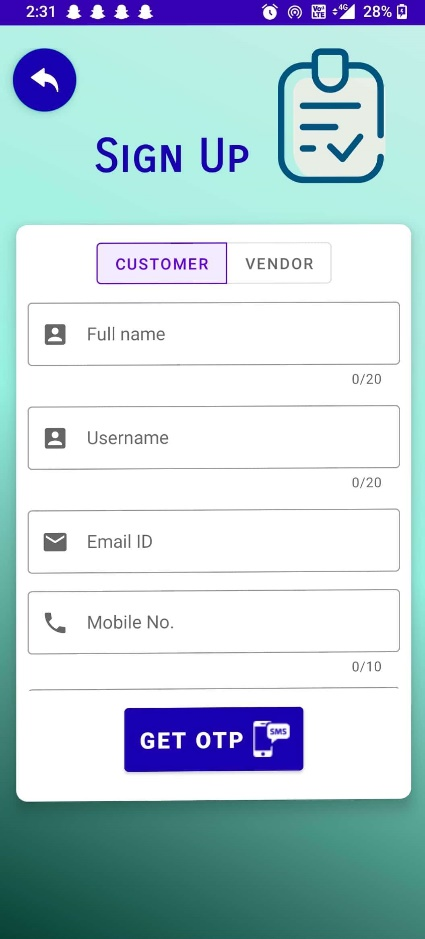</td>
        <td>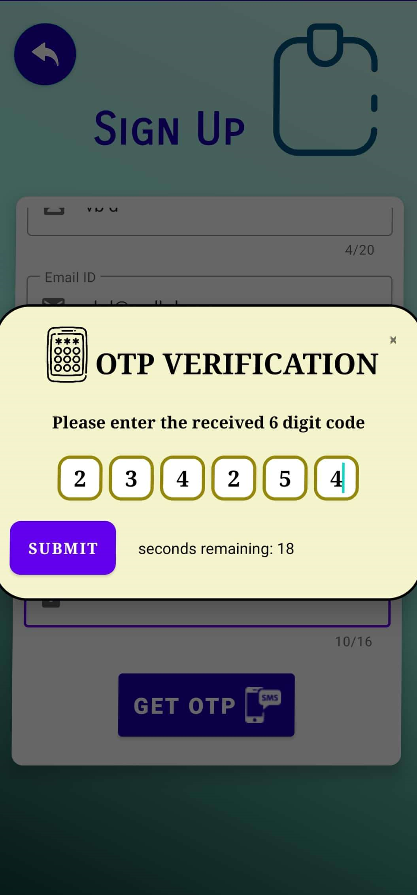</td>
        <td>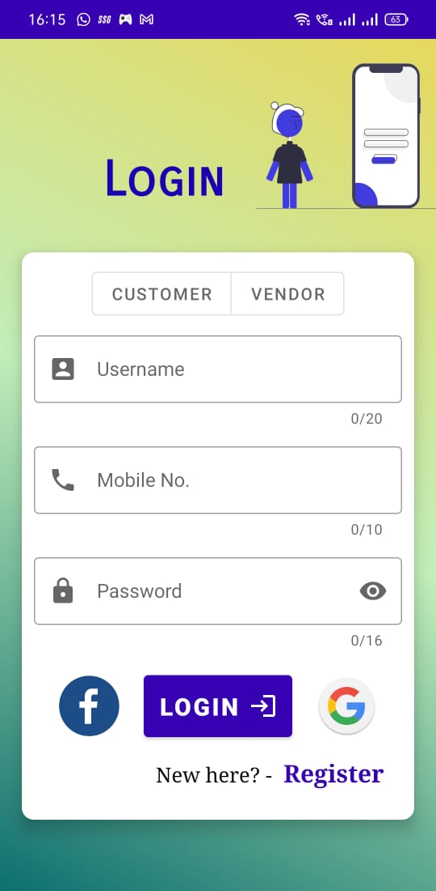</td>
    </tr>
</table>

### Customer Module:

<table>    
    <tr>
        <td>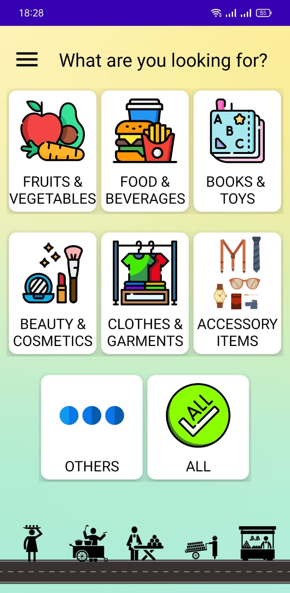</td>
        <td>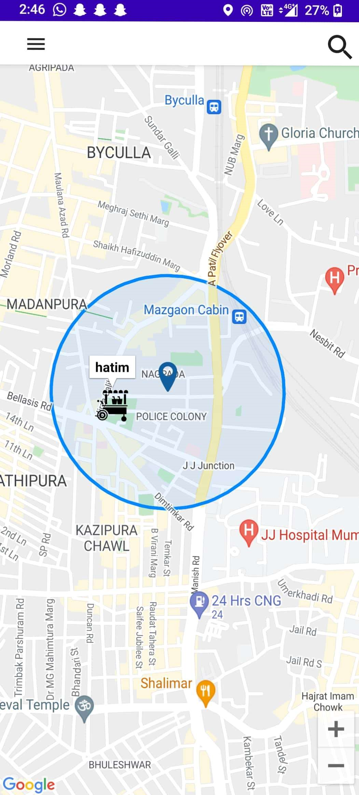</td>
        <td>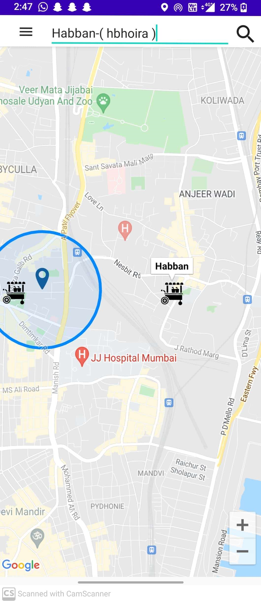</td>
        <td>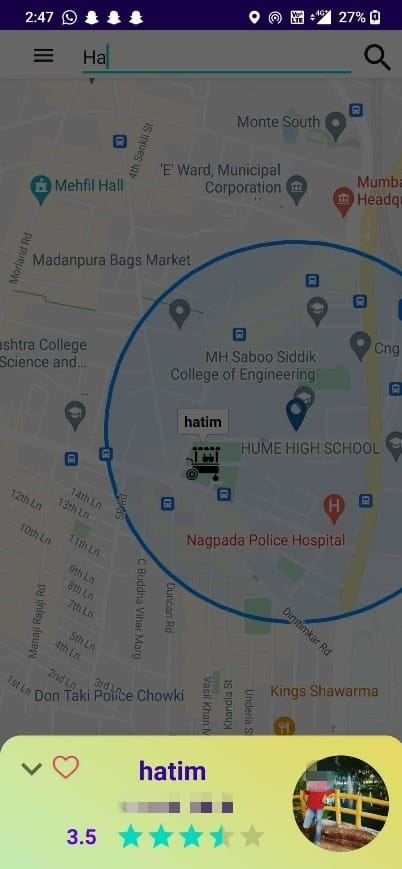</td>
    </tr>
    <tr>
        <td>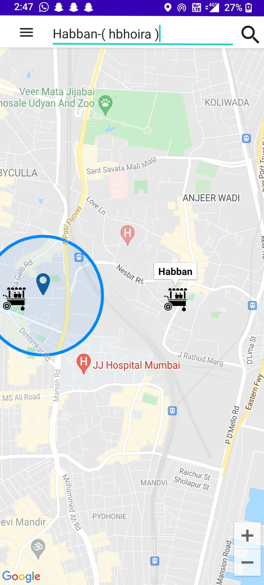</td>
        <td>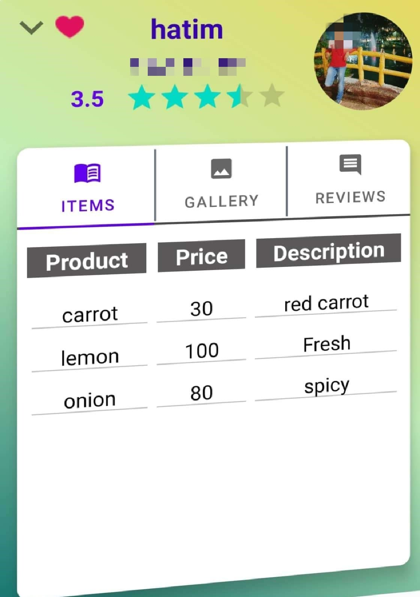</td>
        <td>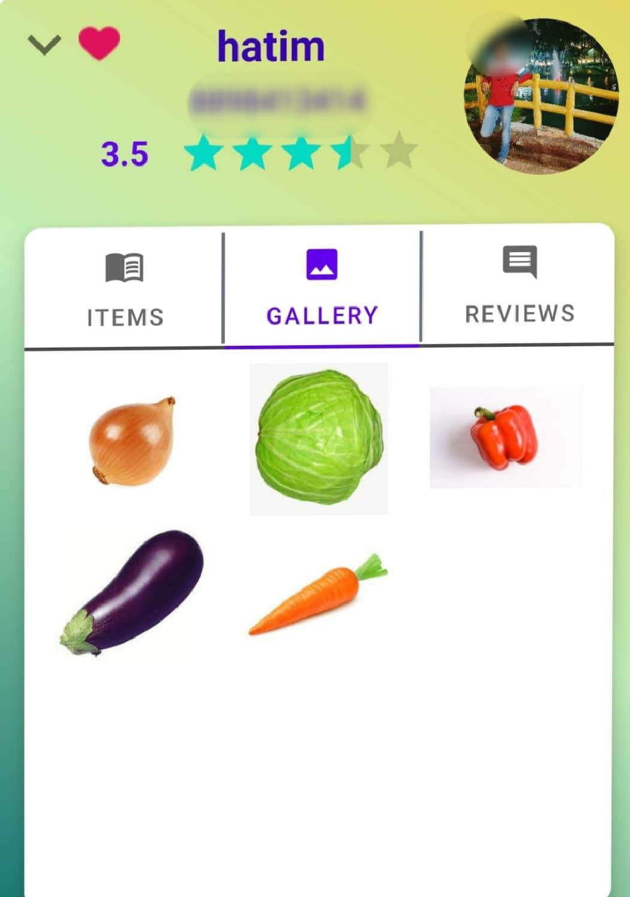</td>
        <td>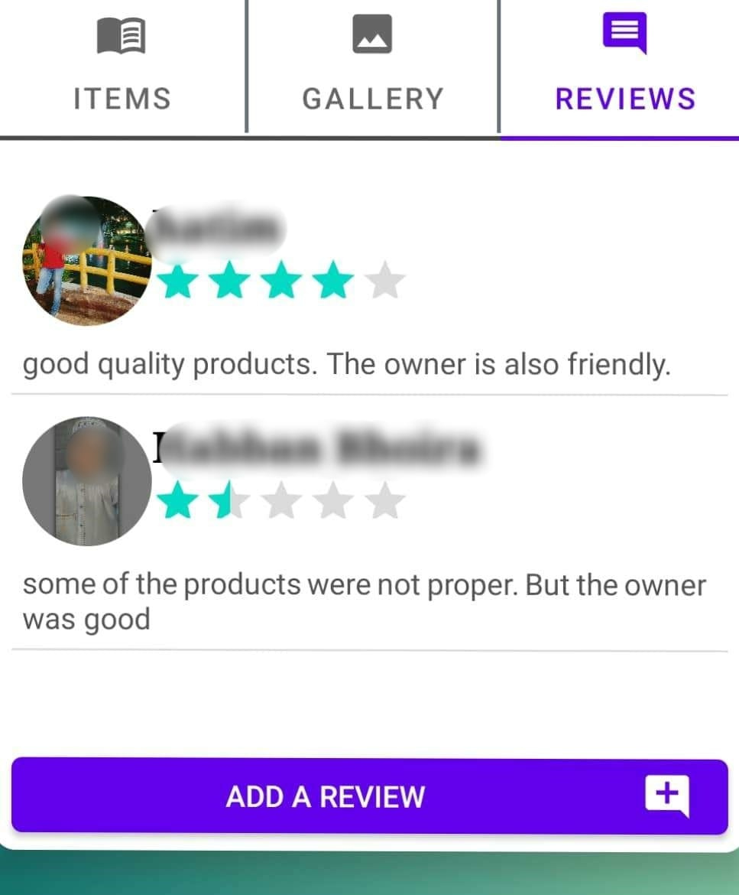</td>
    </tr>
</table>

### Vendor Module:

<table>    
    <tr>
        <td>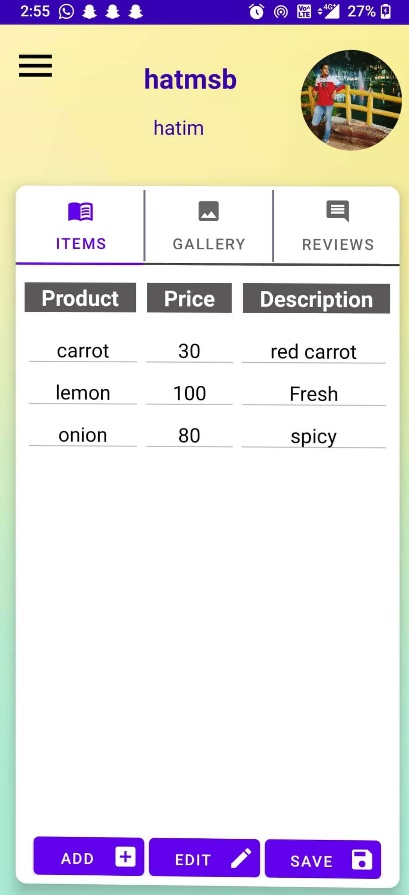</td>
        <td>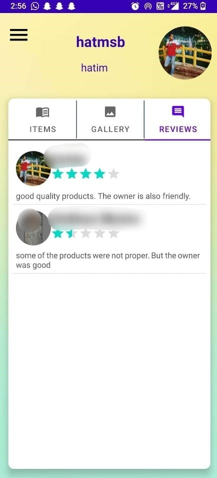</td>
        <td>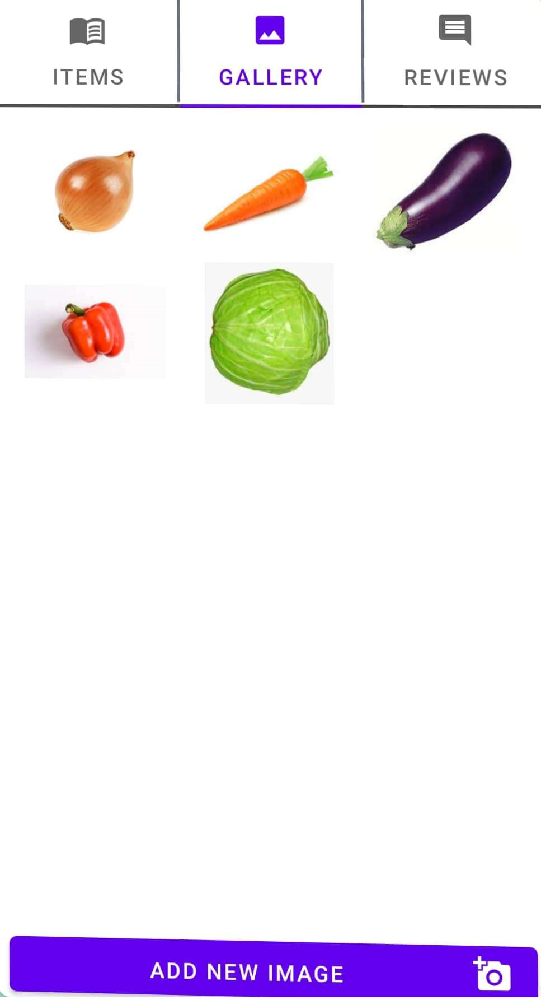</td>
    </tr>
    <tr>
        <td>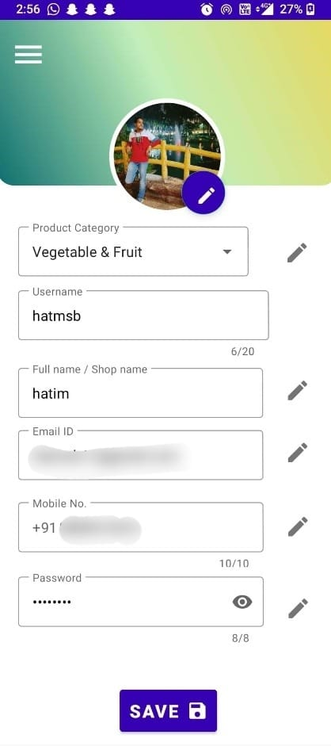</td>
        <td>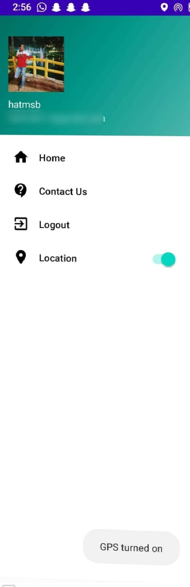</td>
    </tr>
</table>
 
 

## Tech Stack 👨‍💻

- Java
- XML
- Firebase
- Google Maps API
- Google Sign-in API  
- Facebook Sign-in API

